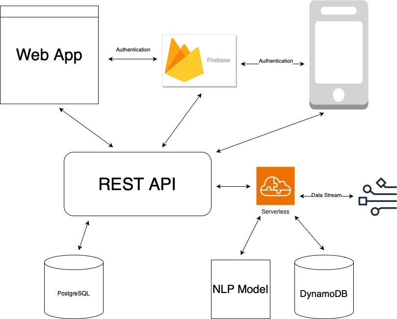

# LoGPT

    

> Checking your logs made easy!

LoGPT is a chatbot to communicate with your Logs. It filters out the most relevant lines from your log file and provides a summary based on the user-specified query. It provides both mobile and web applications for user interaction.

## Architectural Design
We use a serverless architecture that manages the incoming data stream of log files and communicates with DynamoDB and NLP model to compute log file similarity to return the closest log lines. Next, GPT-3 summarizes this log line ouput to provide a high level idea. This result is communicated with our web app and mobile application through the REST API.

    

## User Interface
Below, we provide screenshots demonstrating the login screen and the messaging components of our mobile application.

    
    

